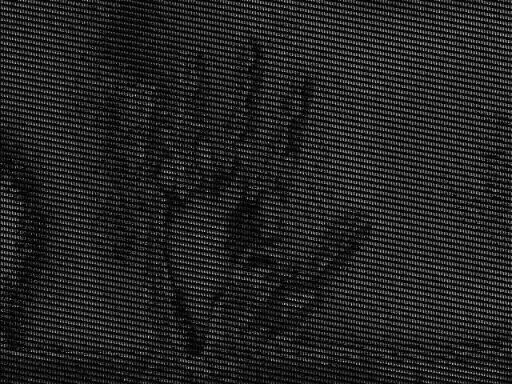

Update new branch:
Run virtual camera emulator IP Core with memory model simulation (mt45w8mw16bgx) at 100MHz board clock.

Image output:

Update new branch:
Get one frame from virtual camera emulator IP Core https://gitlab.com/konrad.oblak/ov7670_camera_emulator and fit in 640x480x1-bit framebuffer.

Image output:

Update:
The same approach but tested with camera emulator IP Core from https://gitlab.com/konrad.oblak/ov7670_camera_emulator used four times as input to the original project (camera emulator operate at ~50MHz).
All stream from four cameras is accomodate on one VGA screen (see image output below), so this can be used as very simple and cheap camera monitoring.

Original project set OV7670 camera registers to QQVGA format (160x120) and RGB444 (12-bit) color so author assume all frame (19200x12bits) fit in BlockRAM's on Spartan3E-1200 device (15x RAMB16 in IP-Core generator).

Framebuffer is smaller and have for now 3bit, so one QQVGA frame fill 5x RAMB16 (synthesis show 4x for each framebuffer, that's maybe better). Two RAMB16 is used for camera registers and can be implemented as LUTs in logic. Device Xilinx Spartan-3E have 28 RAMB16 in his fabric logic, so more camera streams can be connected as input to Digilent Nexys-2 board.

TODO :
- adjust color data pixel order for readable image
- add more cameras (cables must be re-pining)

Image output:

Original image:
https://gitlab.com/konrad.oblak/ov7670_camera_emulator/-/raw/sd_card_test_xc3/vga_example.bmp

Description from original project: https://github.com/jasonsetiawan/ov7670_vga_Nexys2
ov7670_vga_Nexys2

Interfacing Camera Module OV7670 with VGA Monitor through Xilinx FPGA Development Board Nexys2

Warning:
  Your design might has diffent pin assignment.
 
